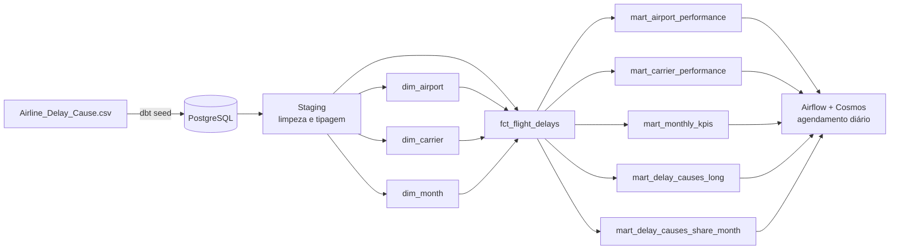

# ✈️ DW Bootcamp — Data Warehouse de Atrasos de Voos nos EUA

Pipeline de dados completo, de ponta a ponta: ingestão, modelagem dimensional, testes de qualidade e orquestração automatizada — construído com **dbt**, **Apache Airflow** e **PostgreSQL**, containerizado com **Docker** e validado por **CI/CD**.

O dataset são **~318 mil registros reais** de atrasos de voos comerciais nos EUA, transformados em um Data Warehouse analítico pronto para consumo por ferramentas de BI.

---

## 🎯 O que este projeto demonstra

- Modelagem dimensional (**Star Schema**) e organização em camadas (**Medallion Architecture**: staging → intermediate → mart)
- Transformações versionadas e testadas com **dbt** (`dbt-utils`, `dbt-expectations`, `dbt-date`)
- Orquestração de pipeline com **Apache Airflow**, gerando tasks automaticamente a partir dos models dbt via **astronomer-cosmos**
- Ambientes **dev/prod** configuráveis via variável do Airflow, sem alterar código
- **CI/CD com GitHub Actions**: valida sintaxe, sobe um Postgres efêmero, roda `dbt build` (seed + run + test) e publica a documentação como artefato a cada push/PR
- Ambiente 100% reprodutível com **Docker** e **UV**

---

## 🏗️ Arquitetura



## 🧰 Stack

| Camada | Tecnologia |
|---|---|
| Banco de dados | PostgreSQL 17 (Docker) |
| Transformação | dbt 1.9+ (Medallion Architecture) |
| Orquestração | Apache Airflow 3.x (Astro Runtime) + astronomer-cosmos |
| Ambiente Python | Python 3.13 + UV |
| CI/CD | GitHub Actions (compile, build, test, docs) |
| Deploy prod | PostgreSQL remoto (Railway) |

---

## 📂 Estrutura do repositório

```
├── 1_local_setup/       # Docker Compose (Postgres) + ambiente Python
├── 2_data_warehouse/    # Projeto dbt: seeds, models (staging/intermediate/mart)
├── 3_airflow/           # Projeto Astro/Airflow + DAG com Cosmos
├── .github/workflows/   # Pipeline de CI (dbt_ci.yml)
└── docs/SETUP.md        # Guia passo a passo completo de instalação e execução
```

## 📊 Modelo de dados

**Fato:** `fct_flight_delays` — cada linha representa uma combinação de mês + companhia aérea + aeroporto, com métricas de voos, atrasos, cancelamentos e minutos de atraso por causa (clima, companhia, sistema aéreo, segurança, aeronave atrasada).

**Dimensões:** `dim_airport`, `dim_carrier`, `dim_month`.

**Marts analíticos:** performance por aeroporto, performance por companhia, KPIs mensais, causas de atraso (formato long para BI) e participação percentual de cada causa por mês.

---

## 🚀 Como rodar

```bash
# 1. Ambiente local (Postgres via Docker)
cd 1_local_setup
uv sync
docker compose up -d

# 2. Data Warehouse (dbt)
cd ../2_data_warehouse/dw_bootcamp
dbt deps --profiles-dir .
dbt build --profiles-dir .

# 3. Orquestração (Airflow)
cd ../../3_airflow
astro dev start
# UI em http://localhost:8080
```

📖 Guia completo com pré-requisitos, configuração de conexões e troubleshooting: **[docs/SETUP.md](docs/SETUP.md)**

---

## ✅ CI/CD

A cada push ou pull request para `main`, o GitHub Actions:
1. Valida a sintaxe de todos os models dbt (`dbt parse`)
2. Sobe um PostgreSQL efêmero e executa o pipeline completo (`dbt seed` → `dbt build` → testes)
3. Gera e publica a documentação do dbt (lineage graph) como artefato do workflow

---

## 📚 Referências

- [dbt](https://docs.getdbt.com) · [astronomer-cosmos](https://astronomer.github.io/astronomer-cosmos/) · [Astro CLI](https://docs.astronomer.io/astro/cli/overview) · [dbt-expectations](https://hub.getdbt.com/calogica/dbt_expectations/latest/)

---

**Autor:** Ian Fava — [GitHub](https://github.com/iannfava)
